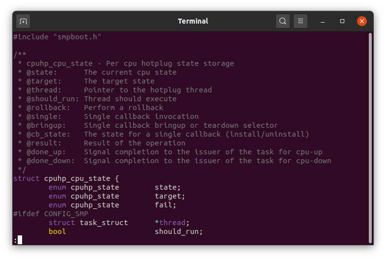

# Syntax highlighter for `less`
Uses [Pygments](https://pygments.org/) to provide syntax highlighting
for supported file types.  The `.lessfilter` is generated by parsing the Pygments documentation website.


## Installation

### 1. Install Pygments & awk
Ensure that you have the latest version of Pygments installed by using [pip](https://pypi.org/project/pip/), as your 
distro's packaged version is likely outdated.  You'll also need `awk`.
```shell
# remove any installed packaged versions
sudo apt autoremove python-pygments python3-pygments

# install latest version
sudo pip install Pygments --upgrade

# install some implementation of `awk`
sudo apt install gawk
```

### 2. Install lesspipe (recommended)
Most Linux distros already have `lesspipe` enabled, but you can check for certain by running:
```shell
echo $LESSOPEN
```
If you don't see `lesspipe` or `lessfile` in the output, install [lesspipe](https://github.com/wofr06/lesspipe).

### 3. Configure Environment Variables
Add the following to `~/.bashrc`
```shell
# sets LESSOPEN and LESSCLOSE variables
eval "$(SHELL=/bin/sh lesspipe)"

# interpret color characters
export LESS='-R'

# to list available styles: `pygmentize -L styles`
export PYGMENTIZE_STYLE='paraiso-dark'

# optional
alias ls='ls --color=always'
alias grep='grep --color=always'
```
If you don't have or want `lesspipe`, replace the above `eval` statement with:
```shell
export LESSOPEN='|~/.lessfilter %s'
```

### 4. Create ~/.lessfilter
Run [main.py](main.py) to generate the latest `.lessfilter` file and place it in your home directory.
Or you can download a pre-generated [.lessfilter](.lessfilter) which is currently at version `2.14.0`.
Check your program version by running `pygmentize -V` to ensure that it is this version or newer.

### 5. Make ~/.lessfilter executable
```shell
chmod +x ~/.lessfilter
```
Done.  Test it out by running `less ~/.lessfilter`
